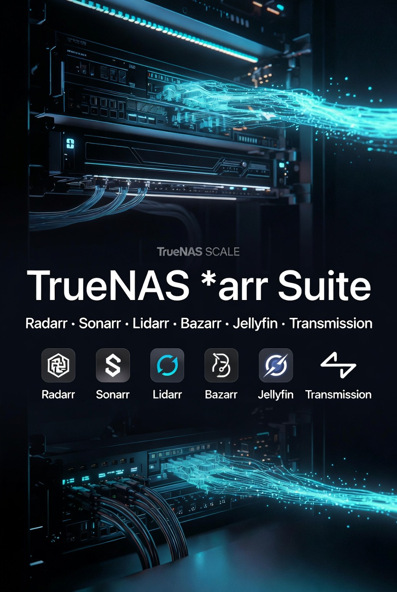

# TrueNAS SCALE *arr Suite

  

**Complete, battle-tested automated media stack** on TrueNAS SCALE with Raspberry Pi Transmission + custom move script.

---

## ✨ Stack Overview

- **Radarr** — Movies
- **Sonarr** — TV Shows
- **Lidarr** — Music
- **Bazarr** — Subtitles
- **Transmission** (on Raspberry Pi) + auto-move script
- **Jellyfin** — Media Server

---

## 🚀 Quick Start

1. Review **[Prerequisites](./docs/01-prerequisites.md)**
2. Set up ZFS datasets & SMB shares
3. Install *arr apps via TrueNAS Apps
4. Configure Transmission + move script
5. Connect everything to Jellyfin

---

## 📖 Full Documentation

| Section | Description |
|---------|-------------|
| **[01-prerequisites.md](docs/01-prerequisites.md)** | Hardware, accounts, assumptions |
| **[02-network-setup.md](docs/02-network-setup.md)** | VLANs & firewall rules |
| **[03-datasets-and-permissions.md](docs/03-datasets-and-permissions.md)** | ZFS structure & permissions |
| **[04-smb-shares.md](docs/04-smb-shares.md)** | SMB share configuration |
| **[05-transmission-rpi.md](docs/05-transmission-rpi.md)** | Raspberry Pi + Transmission setup |
| **[06-radarr-setup.md](docs/06-radarr-setup.md)** | Radarr configuration |
| **[07-sonarr-setup.md](docs/07-sonarr-setup.md)** | Sonarr configuration |
| **[08-lidarr-setup.md](docs/08-lidarr-setup.md)** | Lidarr configuration |
| **[09-bazarr-subtitles.md](docs/09-bazarr-subtitles.md)** | Bazarr setup |
| **[10-jellyfin-integration.md](docs/10-jellyfin-integration.md)** | Jellyfin connections |
| **[11-move-script.md](docs/11-move-script.md)** | Auto-move script (critical) |
| **[12-troubleshooting.md](docs/12-troubleshooting.md)** | Common issues & fixes |

---

## 📸 Screenshots

All detailed screenshots are in the [`screenshots/`](screenshots/) folder (organized by app).

---

## 📦 Apps Export

Exported TrueNAS app configurations are available in the [`apps/`](apps/) folder for easy import.

---

## 🤝 Contributing

Feel free to open issues or suggest improvements!

---

## 📄 License

[MIT License](LICENSE) © 2026 Duc Nguyen

---

**Star this repo if it helps you build your ultimate media stack!** 🎥📺🎵

_Last updated: May 2026_