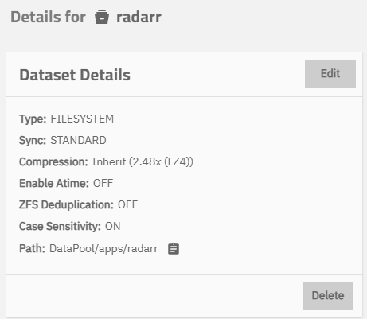
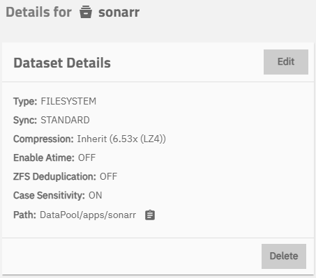
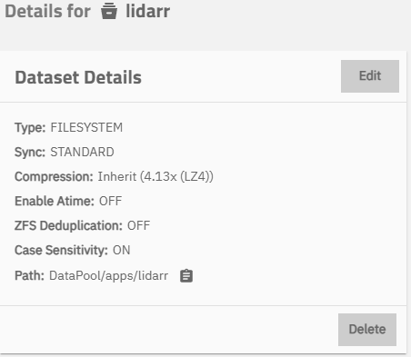
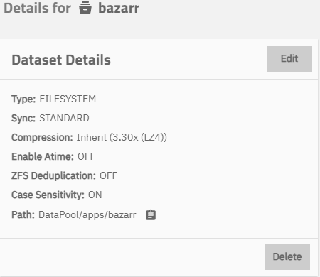

# 03 - Datasets and Permissions

## Dataset Structure
- Apps: `DataPool/apps/radarr`, `/sonarr`, `/lidarr`, `/bazarr`
- Media: `DataPool/Media/Movies`, `/Shows`, `/Music`

## Screenshots






## Permissions
```bash
chown -R mediauser:mediausers /mnt/DataPool/Media
chmod -R 775 /mnt/DataPool/Media