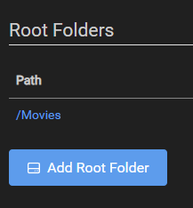
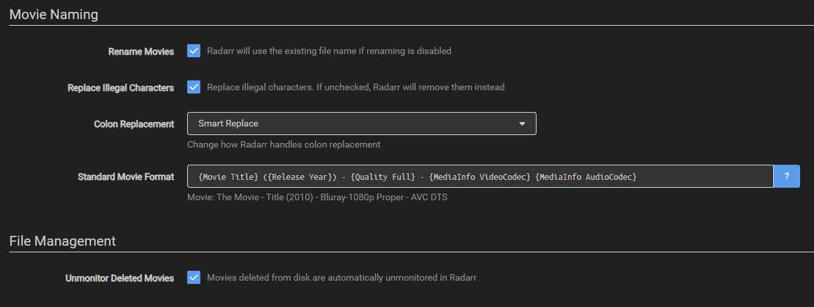
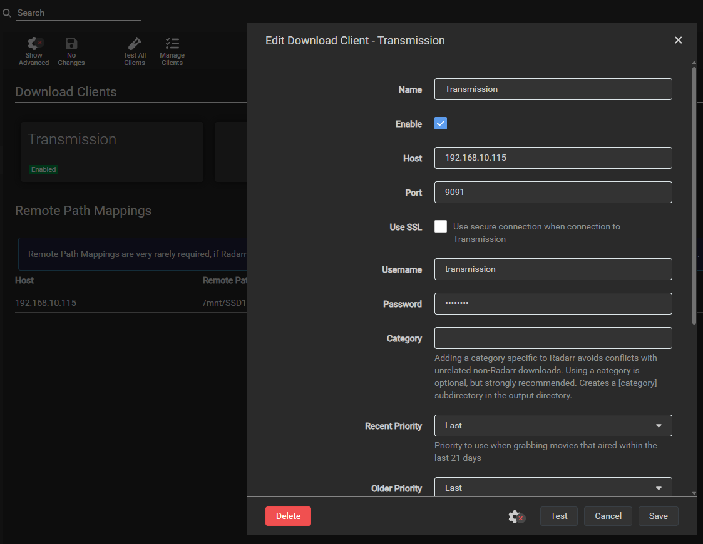

# 06 - Radarr Setup

## Root Folder

## Media Management & Naming

## Download Client

## Jellyfin Connection

## Recommended Naming Scheme (TRaSH Best Practices)

**Movie Folder Format:**

**Standard Movie Format:**

**Example outputs:**
- `The Matrix (1999) - 1080p BluRay x264 DTS 5.1 - YTS`
- `Dune Part Two (2024) - 2160p WEB-DL HDR10 HEVC Atmos 7.1 - BDRip`

## Screenshots

## Key Settings
- **Rename Movies**: Enabled
- **Move Files**: Enabled
- **Delete Empty Folders**: Enabled
- **Unmonitor Deleted Movies**: Enabled
- **Completed Download Handling**: Remove = Yes

**ER-4 Relevance**: Firewall rule 19 allows SMB (445) and ports from VLAN10 (Servers) to TrueNAS.